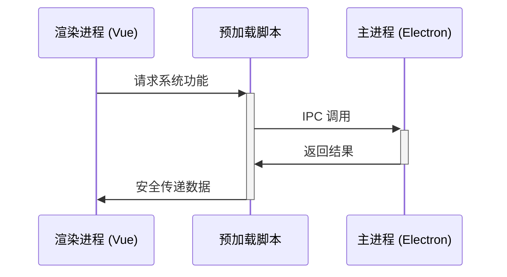

# Snoopy AI Studio


基于 Electron + Vue 3 + TypeScript + Naive UI 的桌面 AI 聊天应用，具有完整的工程化配置和现代化开发体验。

## ✨ 特性

- 🚀 **现代技术栈**: Vue 3 + TypeScript + Naive UI + Electron
- 🛠️ **完整工程化**: ESLint + Prettier + Git Hooks + Commitlint
- 📦 **Monorepo 架构**: pnpm workspace 管理多包项目
- 🔒 **安全优先**: 遵循 Electron 安全最佳实践
- 🎨 **优雅 UI**: 基于 Naive UI 的现代化界面设计
- 🔧 **开发友好**: 热重载、类型检查、自动格式化

## 🚀 快速开始

### 环境要求

- Node.js >= 18.0.0
- pnpm >= 8.0.0

### 安装和启动

```bash
# 1. 克隆项目
git clone <repository-url>
cd snoopy

# 2. 安装依赖
cd frontend
pnpm install

# 3. 启动开发服务器
pnpm start
```

### 开发命令

```bash
# 启动 Electron 应用
pnpm start

# 构建应用
pnpm build

# 打包应用
pnpm compile

# 代码检查和格式化
pnpm lint          # 自动修复
pnpm lint:check    # 仅检查
pnpm format        # 格式化代码
pnpm typecheck     # 类型检查

# 运行测试
pnpm test
```

> [!TIP]
> 查看 [快速参考文档](./docs/QUICK_REFERENCE.md) 获取更多常用命令和开发技巧。

## 🏗️ 技术架构

### 核心技术栈

- **前端框架**: Vue 3 + Composition API
- **类型系统**: TypeScript (严格模式)
- **UI 组件库**: Naive UI
- **状态管理**: Pinia
- **路由管理**: Vue Router 4
- **构建工具**: Vite
- **桌面框架**: Electron
- **包管理器**: pnpm

### 工程化配置

- **代码规范**: ESLint + Prettier
- **Git Hooks**: Husky + lint-staged
- **提交规范**: Commitlint (Conventional Commits)
- **项目结构**: pnpm Workspace (Monorepo)
- **类型检查**: TypeScript 严格模式
- **自动化**: 提交前检查、代码格式化

### 项目结构

```
frontend/
├── .husky/                 # Git Hooks 配置
├── docs/                   # 项目文档
├── packages/               # 子包目录
│   ├── main/              # Electron 主进程
│   ├── preload/           # Electron 预加载脚本
│   └── renderer/          # Vue 渲染进程
│       ├── src/
│       │   ├── components/    # Vue 组件
│       │   ├── views/         # 页面组件
│       │   ├── stores/        # Pinia 状态管理
│       │   ├── services/      # 业务服务
│       │   ├── utils/         # 工具函数
│       │   └── types/         # TypeScript 类型定义
│       ├── eslint.config.js   # ESLint 配置
│       └── .prettierrc.js     # Prettier 配置
├── commitlint.config.js    # 提交信息规范
├── .lintstagedrc.js       # 暂存文件检查
└── package.json           # 依赖管理
```

## 📝 开发指南

### 代码规范

项目使用严格的代码规范来确保代码质量：

- **ESLint**: Vue 3 + TypeScript 规则集
- **Prettier**: 统一的代码格式化
- **TypeScript**: 严格模式类型检查
- **Git Hooks**: 提交前自动检查

### 提交规范

遵循 [Conventional Commits](https://www.conventionalcommits.org/) 规范：

```bash
# 功能开发
git commit -m "feat: 添加用户登录功能"

# 问题修复
git commit -m "fix(chat): 修复消息发送失败问题"

# 文档更新
git commit -m "docs: 更新 API 文档"

# 代码重构
git commit -m "refactor: 重构用户服务模块"
```

### 包结构说明

项目采用 Monorepo 架构，每个包都有独立的职责：

- **`packages/main`** - Electron 主进程实现
- **`packages/preload`** - Electron 预加载脚本
- **`packages/renderer`** - Vue 3 前端应用
- **`packages/integrate-renderer`** - 渲染器集成工具
- **`packages/electron-versions`** - Electron 版本管理工具

### 测试

- **E2E 测试**: 使用 Playwright 进行端到端测试
- **单元测试**: 各包可独立配置测试框架
- **类型检查**: TypeScript 严格模式检查

## 📚 文档

### 完整文档

- **[工程化配置文档](./docs/ENGINEERING_SETUP.md)** - 详细的配置说明和使用指南
- **[快速参考文档](./docs/QUICK_REFERENCE.md)** - 常用命令和快速问题解决
- **[变更日志](./docs/CHANGELOG.md)** - 详细的版本变更记录

### 开发文档

- **[API 文档](./docs/API.md)** - 接口和服务层文档
- **[开发指南](./docs/DEVELOPMENT.md)** - 环境搭建和开发流程
- **[项目状态](./docs/PROJECT_STATUS.md)** - 当前开发状态和计划

## 🚀 构建和部署

### 本地构建

```bash
# 构建所有包
pnpm build

# 打包 Electron 应用
pnpm compile
```

### 生产部署

项目使用 electron-builder 进行应用打包：

- **本地打包**: `pnpm compile` 生成可执行文件
- **自动更新**: 支持通过 GitHub Releases 分发更新
- **多平台**: 支持 Windows、macOS、Linux

### 依赖管理注意事项

- **渲染进程**: 只能使用浏览器兼容的依赖（Vue、axios、lodash 等）
- **主进程**: 可以使用 Node.js 原生 API 和 Node.js 依赖
- **预加载脚本**: 作为渲染进程和主进程的桥梁，提供安全的 API 访问

## 🤝 贡献指南

我们欢迎所有形式的贡献！请遵循以下步骤：

### 开发流程

1. **Fork 项目**
   ```bash
   git clone https://github.com/your-username/snoopy.git
   cd snoopy/frontend
   ```

2. **创建功能分支**
   ```bash
   git checkout -b feature/amazing-feature
   ```

3. **开发和测试**
   ```bash
   pnpm install
   pnpm start
   pnpm lint
   pnpm typecheck
   ```

4. **提交更改**
   ```bash
   git add .
   git commit -m "feat: 添加某个功能"
   ```

5. **推送到分支**
   ```bash
   git push origin feature/amazing-feature
   ```

6. **创建 Pull Request**

### 代码贡献规范

- 遵循项目的 ESLint 和 Prettier 配置
- 使用 Conventional Commits 规范提交信息
- 为新功能添加相应的测试
- 更新相关文档

### 问题报告

如果您发现了 bug 或有功能建议，请：

1. 检查是否已有相关 issue
2. 使用 issue 模板创建新的问题报告
3. 提供详细的复现步骤和环境信息

## 🔧 技术细节

### Electron 架构

项目采用安全的 Electron 架构设计：

- **主进程**: 负责应用生命周期管理和系统 API 访问
- **渲染进程**: 运行 Vue 3 应用，处理用户界面
- **预加载脚本**: 安全地桥接主进程和渲染进程

### 进程间通信



### 环境变量

项目支持多环境配置：

```bash
.env                # 所有环境加载
.env.local          # 本地环境（被 git 忽略）
.env.development    # 开发环境
.env.production     # 生产环境
```

只有以 `VITE_` 前缀的变量会暴露给客户端代码。

## 📊 项目状态

### 当前版本
- **前端**: v1.0.0
- **Electron**: v37.4.0
- **Vue**: v3.5.20
- **TypeScript**: v5.6.3

### 开发进度

- [x] ✅ 基础项目结构
- [x] ✅ 工程化配置完成
- [x] ✅ 代码规范工具配置
- [x] ✅ Git Hooks 自动化
- [x] ✅ Electron 应用框架
- [ ] 🚧 AI 聊天功能开发
- [ ] 📋 用户界面优化
- [ ] 🧪 单元测试覆盖
- [ ] 🚀 CI/CD 流程

### 已知问题

- ESLint 检查存在 72 个问题（主要是未使用变量和类型警告）
- 需要完善 TypeScript 类型定义
- 待添加完整的测试覆盖

## 📄 许可证

本项目采用 [ISC License](LICENSE) 许可证。

## 🙏 致谢

- [Vue.js](https://vuejs.org/) - 渐进式 JavaScript 框架
- [Electron](https://www.electronjs.org/) - 跨平台桌面应用开发框架
- [Naive UI](https://www.naiveui.com/) - Vue 3 组件库
- [Vite](https://vitejs.dev/) - 下一代前端构建工具
- [TypeScript](https://www.typescriptlang.org/) - JavaScript 的超集

## 📞 联系我们

- **项目主页**: [GitHub Repository]
- **问题反馈**: [GitHub Issues]
- **讨论交流**: [GitHub Discussions]

---

**Snoopy AI Studio Team** ❤️
*让 AI 聊天更简单、更智能*
