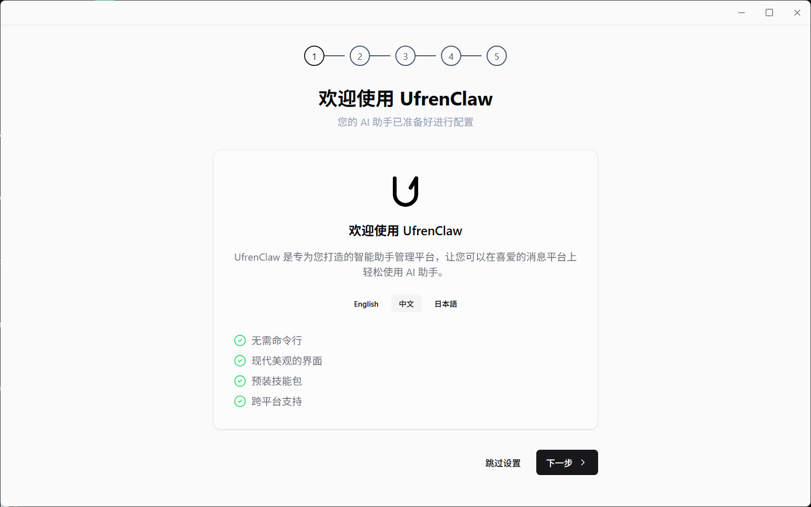
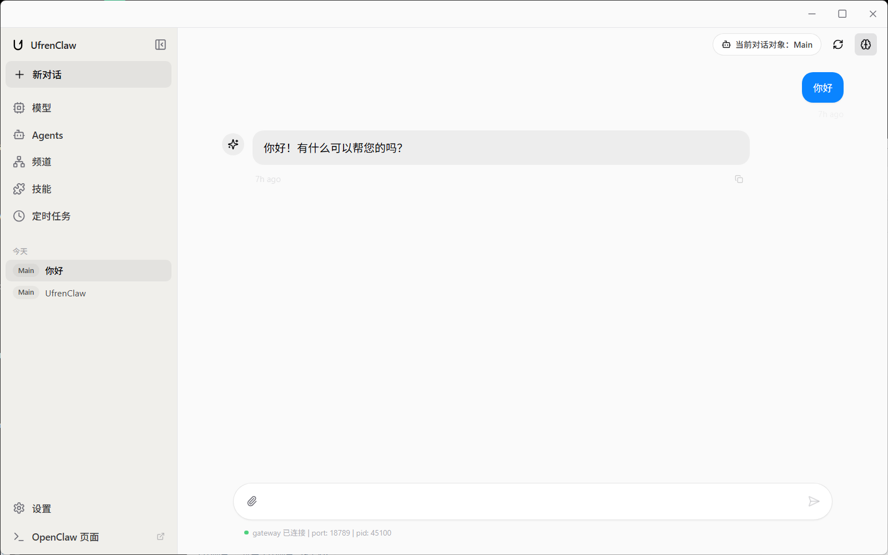
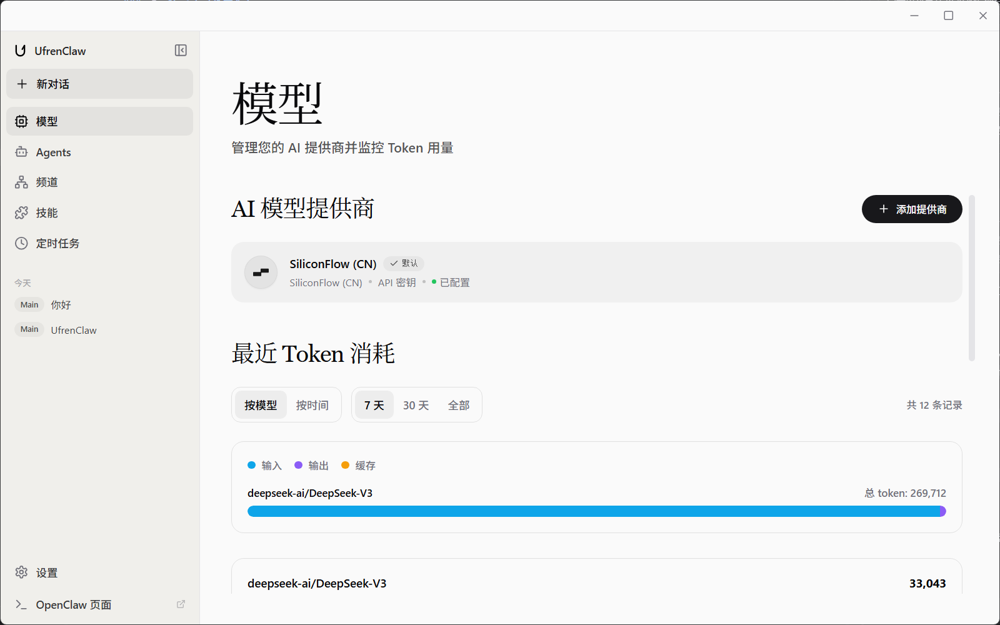
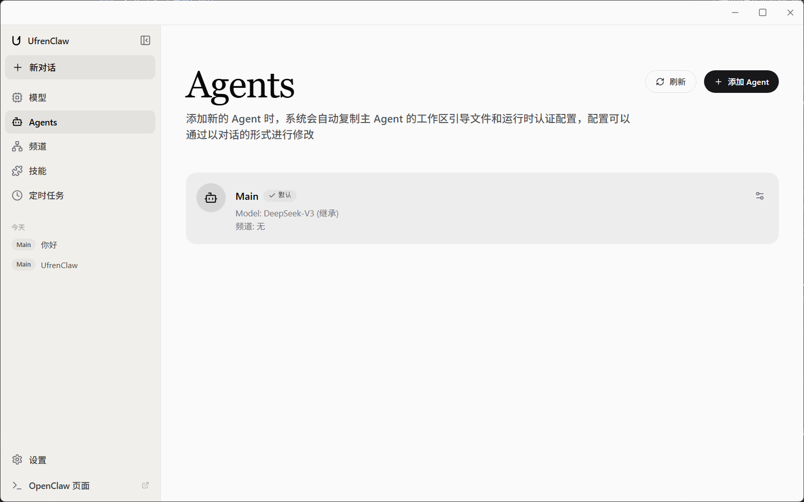
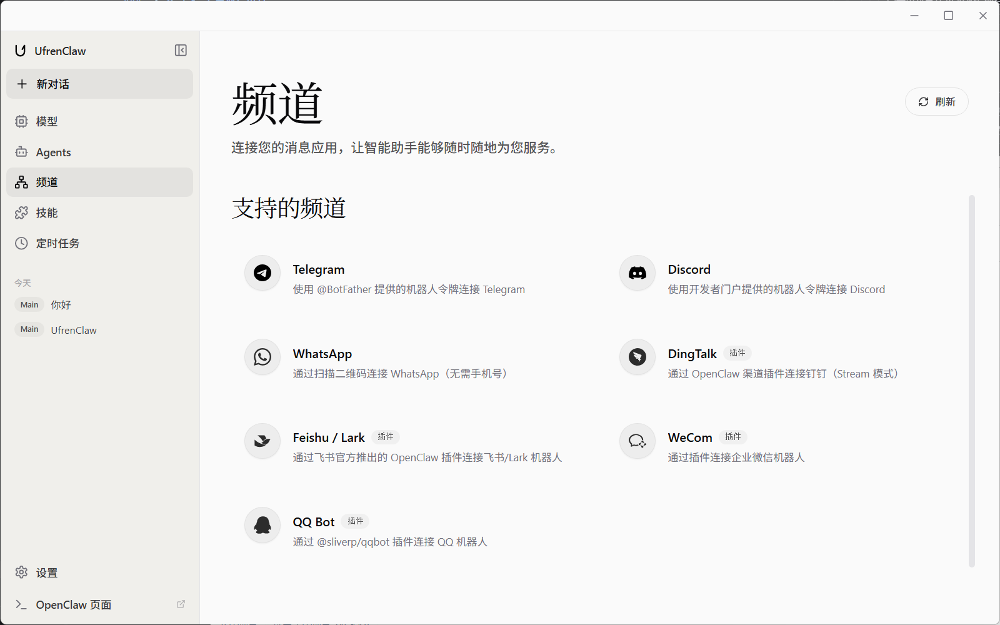
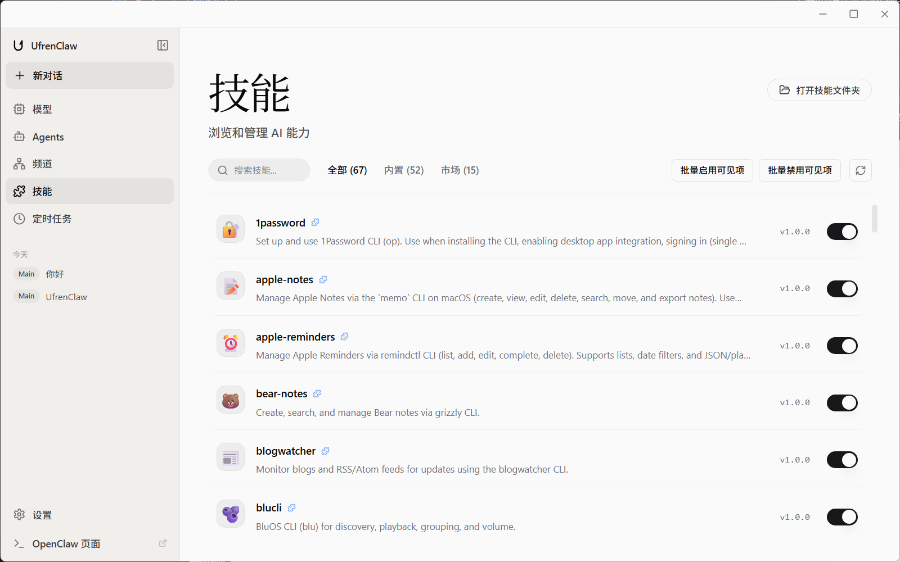
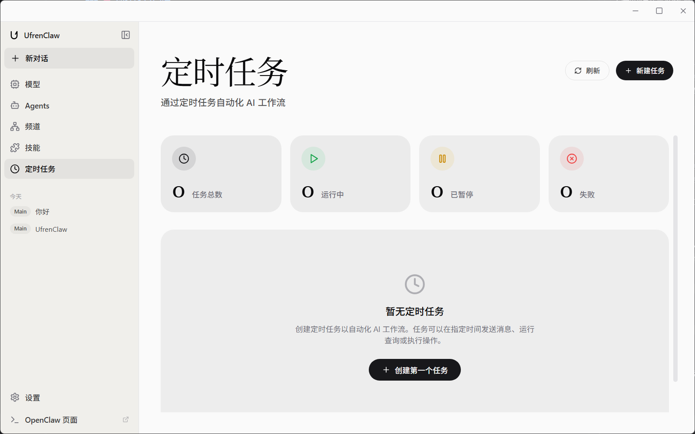
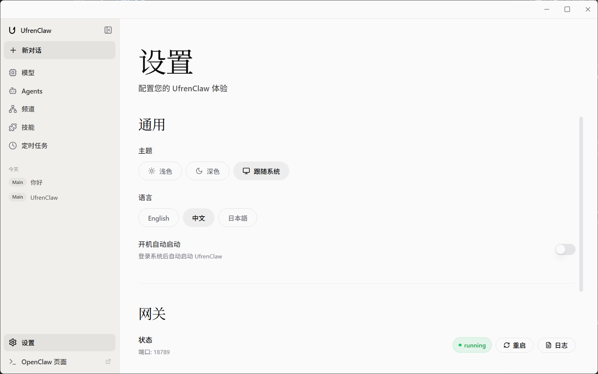

# UfrenClaw

[English](./README.md) | [简体中文](./README_zh-CN.md) | [日本語](./README_ja.md)


**UfrenClaw** は、Electron、React、OpenClaw をベースに構築された**次世代のデスクトップ AI アシスタント**です。

洗練された UI だけでなく、ローカルインテリジェンスへの入り口でもあります。OpenClaw Gateway と深く統合することで、強力な **エージェントワークフロー** をデスクトップにもたらし、AI を「会話するだけの存在」から「目標を理解し、計画し、ツールで実行できる相棒」へ進化させます。開発者、クリエイター、そして効率を追求するすべての方へ、UfrenClaw はワークフローを近く・速く・プライベートに保ちます。

## ✨ 主な特徴

- 🚀 **モダンなスタック**: React 19 + TypeScript + Vite で快適な開発体験。
- 🎨 **洗練 UI**: Tailwind CSS + Framer Motion による滑らかな操作感。
- 🤖 **エージェント AI**: OpenClaw と深く統合し、多段の計画・実行・ツール利用を支援。
- 🧠 **ローカルファースト**: Ollama をネイティブサポート。プライバシーと速度を両立。
- 🔒 **安全設計**: Electron のベストプラクティスに沿ったサンドボックス/隔離。

## 🧩 機能モジュール

> 「もう一つのチャットアプリ」ではなく、「デスクトップ上のエージェント作業台」。UfrenClaw は OpenClaw Gateway を中心に、モデル・エージェント・チャンネル・スキル・定期タスクを組み合わせて、ローカルファーストな知能ループを構成します。
>
> 📸 スクリーンショットは `./screenshots/` に配置されています。

- 🧭 **Setup（初回セットアップ）**：環境チェック、ゲートウェイ起動、基本設定
- 💬 **Chat（会話ワークベンチ）**：ストリーミング応答、思考表示、ツール結果の可視化
- 🧪 **Models（プロバイダー＆使用量）**：プロバイダー/モデル管理と Token 使用量の追跡
- 🧠 **Agents（エージェント管理）**：目的別エージェントの作成・運用
- 🔌 **Channels（チャンネル接続）**：Telegram / Discord / WhatsApp / DingTalk / Feishu / WeCom / QQ など
- 🧰 **Skills（スキル）**：スキルの導入・有効化・設定で能力を拡張
- ⏱️ **Cron（定期タスク）**：定期プロンプトで繰り返し業務を自動化
- ⚙️ **Settings（設定）**：外観、ゲートウェイ/プロキシ、更新、詳細ポリシーを一括管理

### 🧭 Setup｜初回セットアップ

- ✅ **環境チェック**：必要な実行環境とコアサービス（例：ゲートウェイ）を検証
- 🧷 **プロバイダー設定**：AI プロバイダーと認証情報を設定
- 🔌 **チャンネル接続（任意）**：必要に応じてメッセージアプリと連携
- 🧾 **ログ確認**：手順中にログ/エラー詳細を確認可能



### 💬 Chat｜会話ワークベンチ

- ⚡ **ストリーミング出力**：生成と同時に表示
- 🧠 **思考表示トグル**：利用可能な場合に思考を表示/非表示
- 🛠️ **ツール呼び出し可視化**：実行内容・結果・エラーを明確に表示
- 📎 **添付入力**：ファイル/画像の入力に対応（ゲートウェイ/モデル次第）
- 🧭 **セッション/エージェント操作**：更新、切替、状態管理



### 🧪 Models｜プロバイダー＆使用量

- 🧩 **プロバイダー管理**：複数アカウント/モデルの追加・管理
- 🧯 **フォールバック**：サポート範囲で回退戦略を設定
- 📈 **Token 使用量**：モデル別/時間別に最近の使用量を集計
- 🧾 **追跡性**：セッション/エージェント/モデル/プロバイダー単位で確認（利用可能な場合）



### 🧠 Agents｜エージェント管理

- 🧬 **作成/管理**：用途別にエージェントを構築
- ⭐ **既定エージェント**：日常利用のメインを指定
- 🔌 **チャンネル紐付け**：チャンネル単位で配信範囲を制御
- 🧩 **モード切替**：開発・文章・運用・アシスタントなど目的で切替



### 🔌 Channels｜チャンネル接続

- 🌐 **統合管理**：複数プラットフォームを 1 画面で管理
- 🧷 **ガイド付き設定**：必要項目とドキュメントリンクを提供
- 🧾 **QR/外部認証**：対応プラットフォームは QR/外部リンクで認証
- 🔄 **状態表示**：接続中/接続済み/失敗を明確化し、更新と再接続をサポート



### 🧰 Skills｜スキル

- 🧩 **管理**：検索、ON/OFF、アンインストール
- 🔐 **設定分離**：スキルごとに API キー/環境変数を設定
- 🧾 **クイックアクセス**：Clawhub への遷移、README/編集入口を開く（利用可能な場合）
- 🧠 **能力拡張**：ツールとワークフローをエージェントへ追加



### ⏱️ Cron｜定期タスク

- 🕰️ **プリセット + カスタム**：よく使う周期と Cron 式をサポート
- 📨 **定期プロンプト**：時刻に合わせてプロンプトを実行。UI から作成したタスクは既定で UfrenClaw のチャットへ結果を返します（投げ先はゲートウェイが担当）
- ⏯️ **有効/停止**：トグルでいつでも切替
- 🧾 **実行情報**：前回/次回の実行情報と結果（利用可能な場合）



### ⚙️ Settings｜設定

- 🎛️ **外観**：テーマ（ライト/ダーク/システム）、言語、自動起動
- 🔐 **プロバイダー認証**：アカウント/モデル/認証方式の管理
- 🧱 **ゲートウェイ/ネットワーク**：状態/ポート/ログ、プロキシとバイパス
- 🧭 **転送ポリシー**：WS / HTTP / IPC フォールバック設定
- 🧬 **更新**：自動チェック/自動ダウンロード



## 🚀 クイックスタート

### 前提条件

- **Node.js** >= 20.0.0
- **pnpm** >= 9.0.0

### インストールと起動

```bash
# 1. リポジトリをクローン
git clone <repository-url>
cd snoopy

# 2. 依存関係をインストール
cd frontend
pnpm install

# 3. 開発サーバーを起動
pnpm dev
```

## 🏗️ アーキテクチャ

```mermaid
graph TD
    User[ユーザー] --> UI[UfrenClaw UI (React 18)]
    UI --> Main[Electron メインプロセス]
    Main --> Gateway[OpenClaw ゲートウェイ]
    Gateway --> LLM[LLM プロバイダー]
    Gateway --> Tools[ツール / スキル]
```

- **フロントエンド**: React 18, TypeScript, Tailwind CSS, shadcn/ui
- **コア**: Electron 37
- **状態管理**: Zustand
- **AI エンジン**: OpenClaw Gateway (ローカル & リモート)

## 📄 ライセンス

本プロジェクトは [ISC License](LICENSE) の下で公開されています。

---

**UfrenClaw Team** ❤️
*知性を解き放ち、あなたに力を。*
